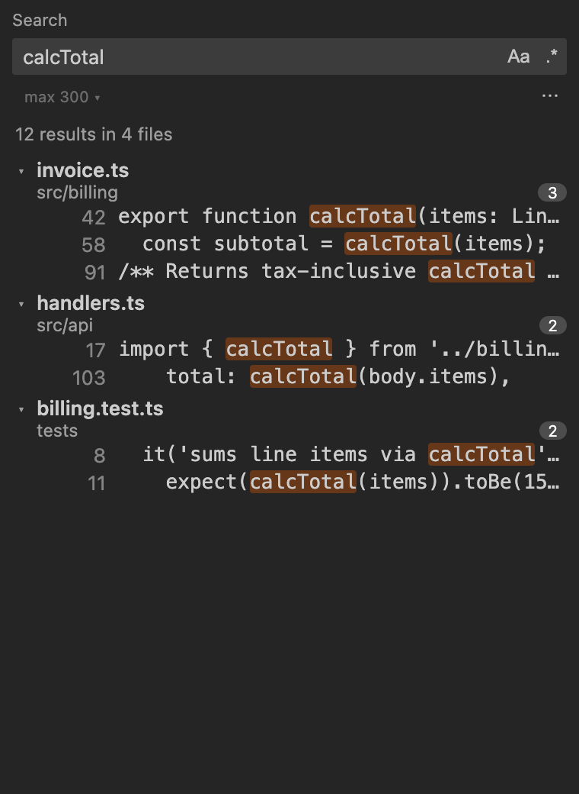
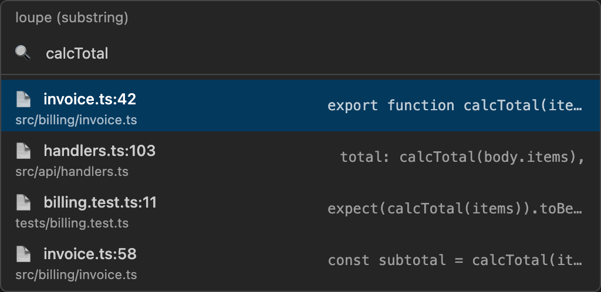

# Loupe Search

**Fast indexed full-text search inside VS Code** — substring and regex, with per-folder encoding support (UTF-8, Shift_JIS, EUC-JP). A native Rust binary is bundled with the extension; no Docker or extra runtime.

Open a workspace, build the index once, then search across your tree in milliseconds. The index updates incrementally as files change.

## Screenshots

### Sidebar search

Click the **loupe** icon in the Activity Bar (or press `Ctrl+Alt+Shift+F`). Results stream in, grouped by file, with match highlighting.



### QuickPick search

Press `Ctrl+Alt+F` for a lightweight one-shot search. Results appear in a filterable dropdown; press Enter to open the selected file.



## Getting started

1. **Install** this extension from the Marketplace.
2. **Open a folder** in VS Code.
3. On first launch, loupe prompts **"Build it now?"** — accept it, or run **loupe: Build / rebuild index** from the Command Palette.
4. **Search** with `Ctrl+Alt+F` (QuickPick) or focus the sidebar with `Ctrl+Alt+Shift+F`.

The extension bundles a `loupe` binary for your platform. If no `.loupe/settings.json` exists yet, the first build indexes the whole workspace as UTF-8.

## How to search

### Sidebar view

- Type in the search box — results update as you type (queries need at least 3 characters).
- **`Aa`** — toggle case-sensitive matching (default: case-insensitive).
- **`.*`** — toggle regular expression mode (pattern needs a literal run of ≥3 characters).
- **max ▾** — cycle max results: 50 / 100 / 300 / 1000 / ∞.
- **`···`** — show path filters:
  - **Files to include** — e.g. `src/`, `*.java`
  - **Files to exclude** — e.g. `*.min.js`, `test/`
  - Glob patterns (`*`, `**`, `?`) are supported; plain text matches as a path substring. Filters apply client-side without re-searching.
- Click a result row to open the file at that line. Click a file header to collapse/expand the group.

### QuickPick

- `Ctrl+Alt+F` — substring search in a dropdown.
- **loupe: Search (regex)** — regex search via QuickPick (Command Palette).

## Commands

| Command | Keybinding | Description |
| --- | --- | --- |
| **loupe: Search (substring)** | `Ctrl+Alt+F` | QuickPick — substring search |
| **loupe: Search (regex)** | — | QuickPick — regex search |
| **loupe: Focus Search View** | `Ctrl+Alt+Shift+F` | Focus the sidebar search panel |
| **loupe: Build / rebuild index** | — | Sync / rebuild the index |

## VS Code settings

| Setting | Default | Description |
| --- | --- | --- |
| `loupe.indexDir` | *(empty)* | Index directory. Empty = `<workspace>/.loupe`. |
| `loupe.binaryPath` | *(empty)* | Path to the `loupe` executable. Empty = bundled binary. |
| `loupe.maxResults` | `300` | Default max results for search. |

**Roots and encodings are not VS Code settings.** They live in `<indexDir>/settings.json` so the extension, CLI, and MCP server always agree on what is indexed.

### Optional: `settings.json`

To index specific folders or non-UTF-8 encodings, create `.loupe/settings.json` in your workspace:

```jsonc
{
  "roots": [
    { "path": "src",    "encoding": "utf-8" },
    { "path": "assets", "encoding": "shift_jis" }
  ]
}
```

You can write this file with the `loupe init` CLI command, or edit it by hand. See the [repository README](https://github.com/ukitomato/loupe#-configuration--settingsjson) for details.

## More

- **CLI & MCP server** — same index, same `settings.json`. See the [main README](https://github.com/ukitomato/loupe).
- **License** — MIT. Built on [Tantivy](https://github.com/quickwit-oss/tantivy).
